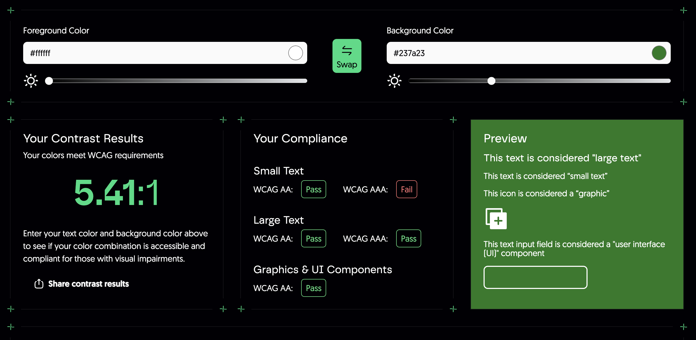
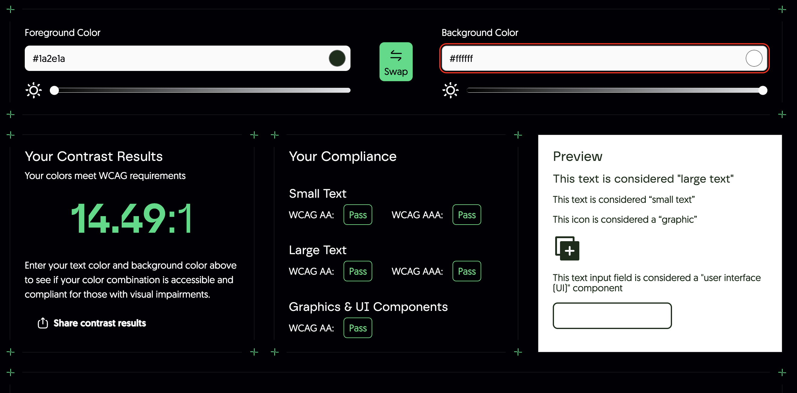
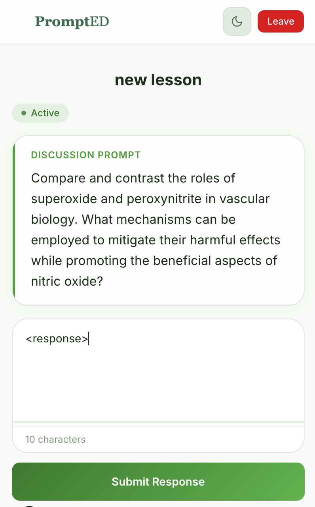
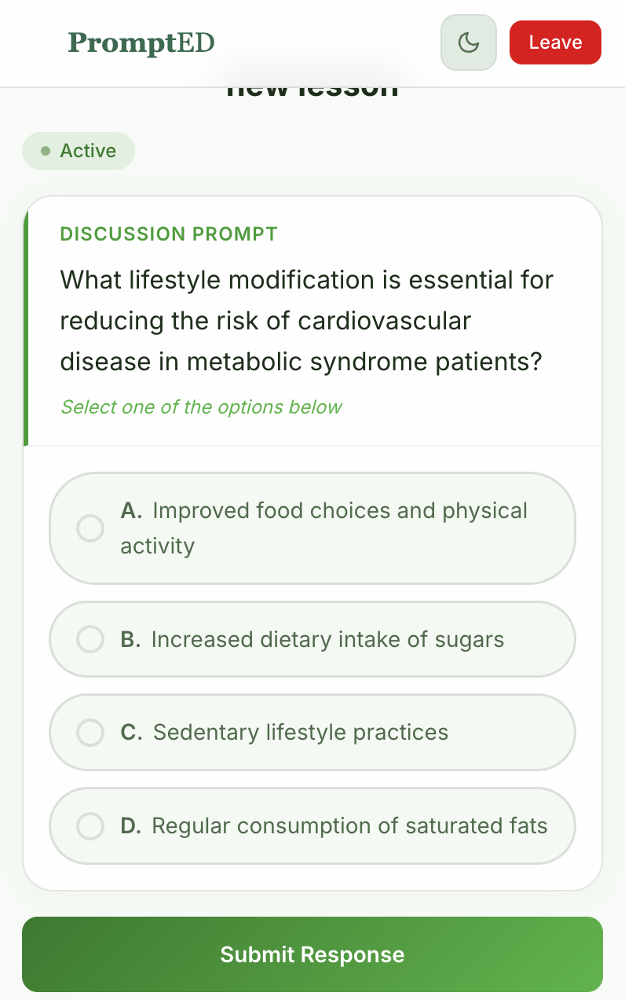
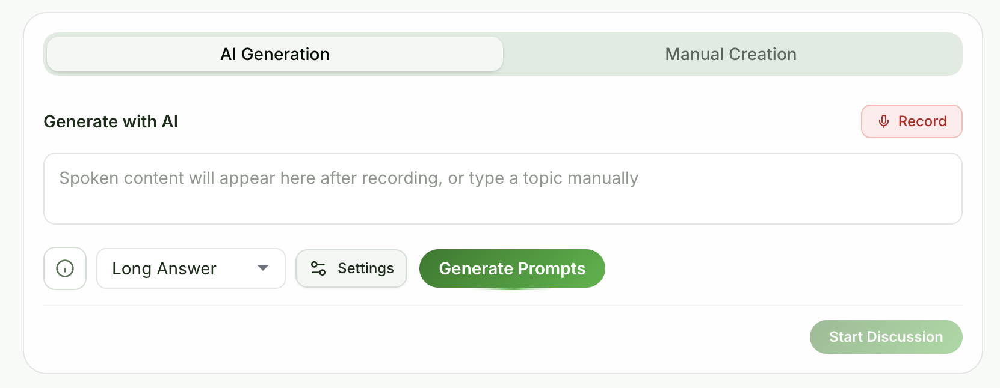

# Accessibility & Style

Our style guidelines prioritize legibility, clear contrast, and easily tappable interfaces.

## 1. Color & Contrast (Mandatory)
We cannot rely on color alone to convey meaning (e.g., a red background for an error must also have an error icon or clear text message).

* **The Contrast Rule:** All text and critical UI elements MUST pass a WCAG AA contrast ratio (at least 4.5:1 for normal text, and 3:1 for large text).
* **The Tool:** Before adding any new color combination to the UI, you must verify it passes using this [Colour Contrast Checker](https://accessibilityaid.com/free-tools/colour-contrast-checker).

### Color Contrast Checker Results

<!-- SCREENSHOT: Run the Colour Contrast Checker (https://accessibilityaid.com/free-tools/colour-contrast-checker)
     with foreground=#ffffff (button text) and background=#237a23 (--color-primary-600).
     Save screenshot to: docs/images/accessibility/contrast-primary-button.png -->

<!-- SCREENSHOT: Run the Colour Contrast Checker with foreground=#1a2e1a (--text-primary)
     and background=#ffffff (page background).
     Save screenshot to: docs/images/accessibility/contrast-body-text.png -->

---

## 2. Typography & Scale
Because we are designing for two drastic extremes (a massive projector screen vs. a 6-inch phone), text scaling is critical.

* **Instructor View (Projector/Desktop):** Text must be large enough to be read from 30 feet away. Use heavy, high-contrast headings for the AI-generated prompts. Avoid ultra-thin font weights entirely.
* **Student View (Mobile):** Base body text must be at least `16px`.

<!-- SCREENSHOT: Capture the student mobile view (browser dev tools, ~375px width) showing
     the prompt card and response input at readable text size.
     Save screenshot to: docs/images/accessibility/typography-student-mobile.png -->

---

## 3. Touch Targets & Interactivity
Students are often interacting with the app quickly, sometimes with one hand while taking notes.

* **Minimum Touch Area:** Any clickable element (buttons, links, form inputs) must have a minimum touch target area of `45x45 pixels`.
* **Safe Spacing:** Provide ample padding between clickable elements to prevent "fat-finger" errors (e.g., accidentally hitting "Submit" instead of "Cancel").

<!-- SCREENSHOT: Capture the student MC option buttons on mobile view. Use dev tools to
     show element dimensions meet the 45x45px minimum.
     Save screenshot to: docs/images/accessibility/touch-targets-mc-options.png -->

---

## 4. Visual Hierarchy & Focus States
Instructors managing a live lecture might use keyboard navigation to quickly jump through the dashboard.

* **Focus Indicators:** Never remove the default browser focus outline (`outline: none;`) for keyboard users unless you are replacing it with a custom, highly visible focus ring.
* **Action Colors:** Reserve your primary, most vibrant color *only* for primary actions (like "Generate Prompt" or "Submit Answer"). Do not use the action color for static text or decorative backgrounds, as it confuses users about what is clickable.

<!-- SCREENSHOT: Capture the instructor center panel showing the primary green used only
     on action buttons (Generate Prompts, Start Discussion) while static text uses neutral colors.
     Save screenshot to: docs/images/accessibility/action-color-hierarchy.png -->

