# Software Design

This document describes the high-level software design of the PMCOL Teaching Tool, focusing on the system architecture, core domain entities, and key interaction scenarios. The system follows a layered architecture with a React-based web frontend, a Next.js backend providing API routes and real-time WebSocket communication, and external services for authentication, speech-to-text transcription, and AI-driven prompt generation. Persistent data storage and real-time synchronization are handled through Supabase. The included diagrams illustrate how instructors and students interact with the system, how lessons and discussions are managed securely and anonymously, and how data flows through the system to support real-time classroom engagement.

---

## Architecture Diagram
<description>

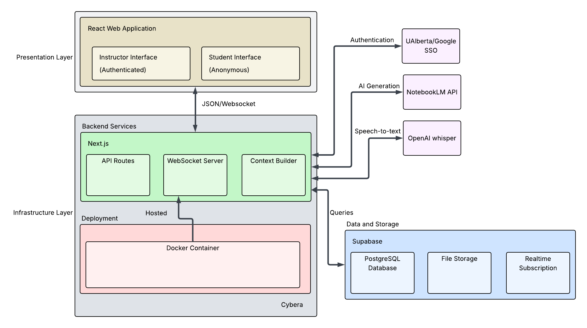

---

## UML Class Diagram
<description>

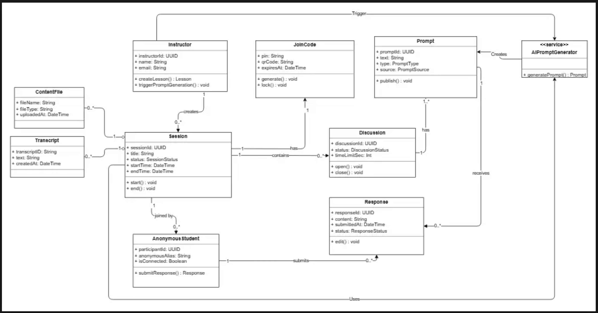

---

## Sequence Diagrams
<description>

### Discussion Lifecycle + Response Rules + Moderation + Analytics
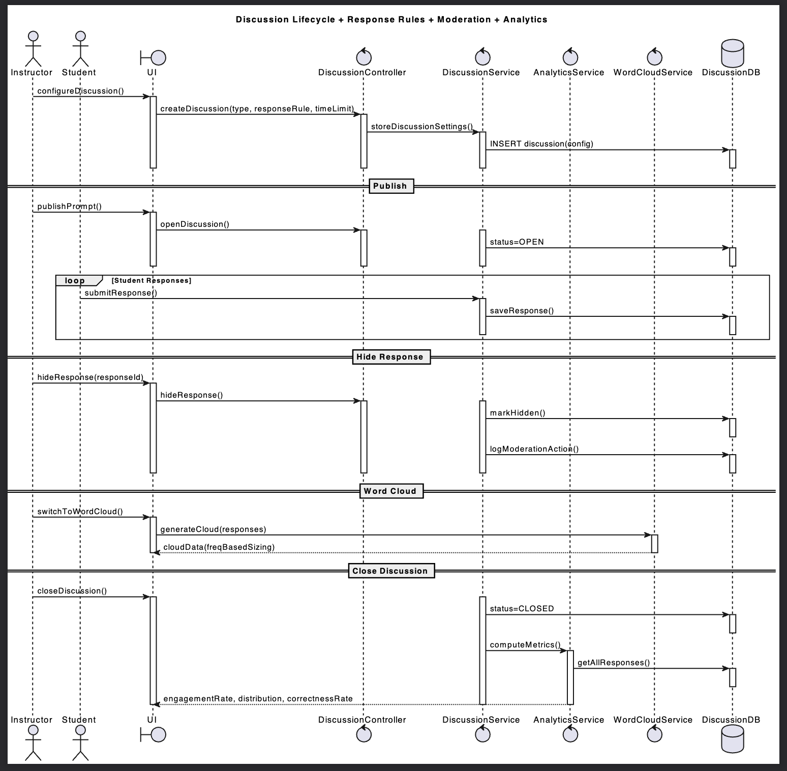

### Edit AI Prompt + View Original + Revert
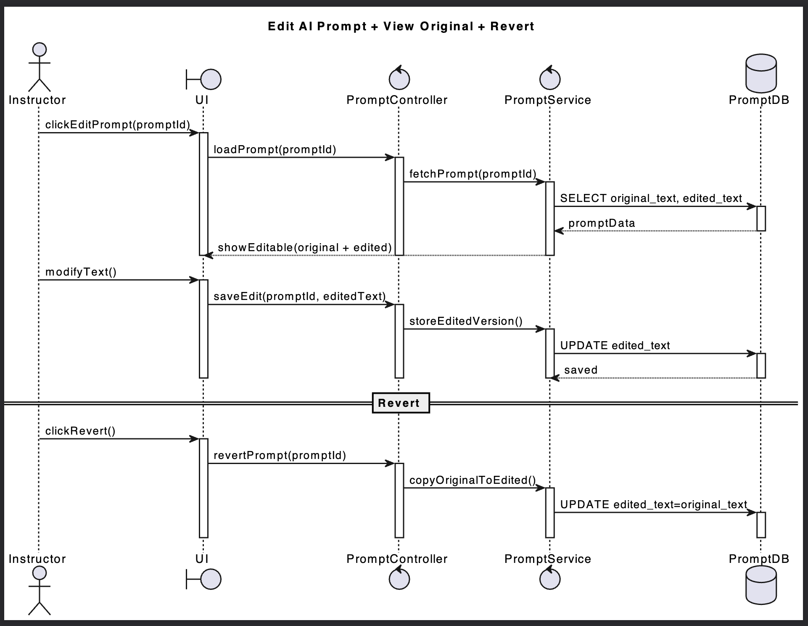

### Instructor Dashboard + Lesson Privacy Enforcement
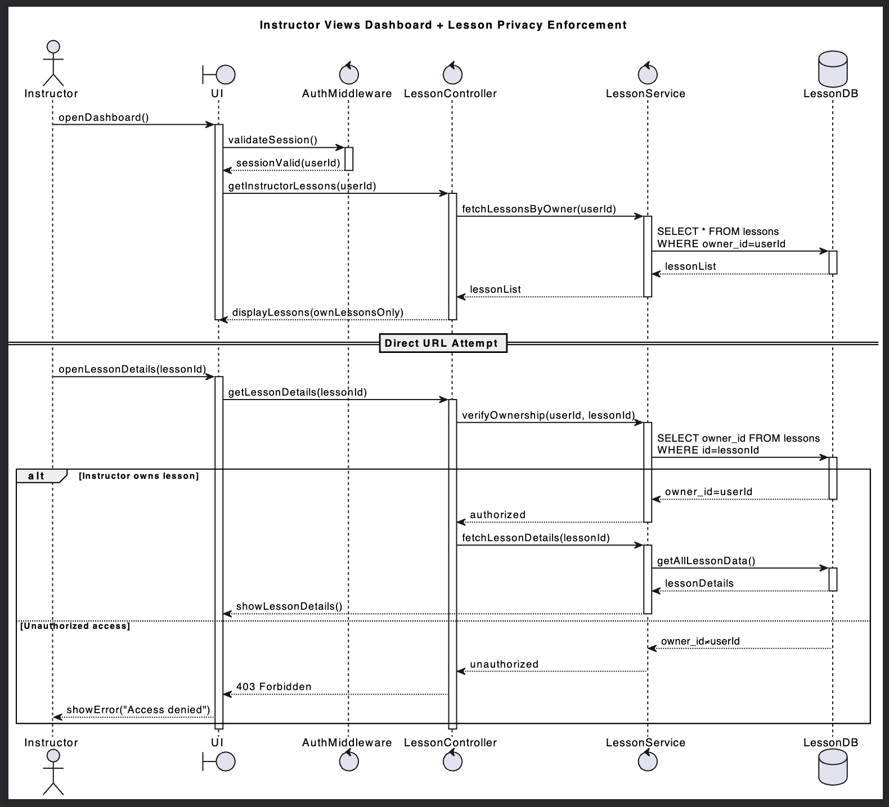

### Resume Unfinished Lesson with Full Data Restore
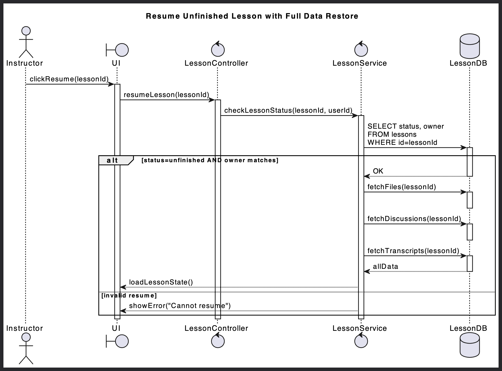

### Student Join + Errors + Submission Confirmation
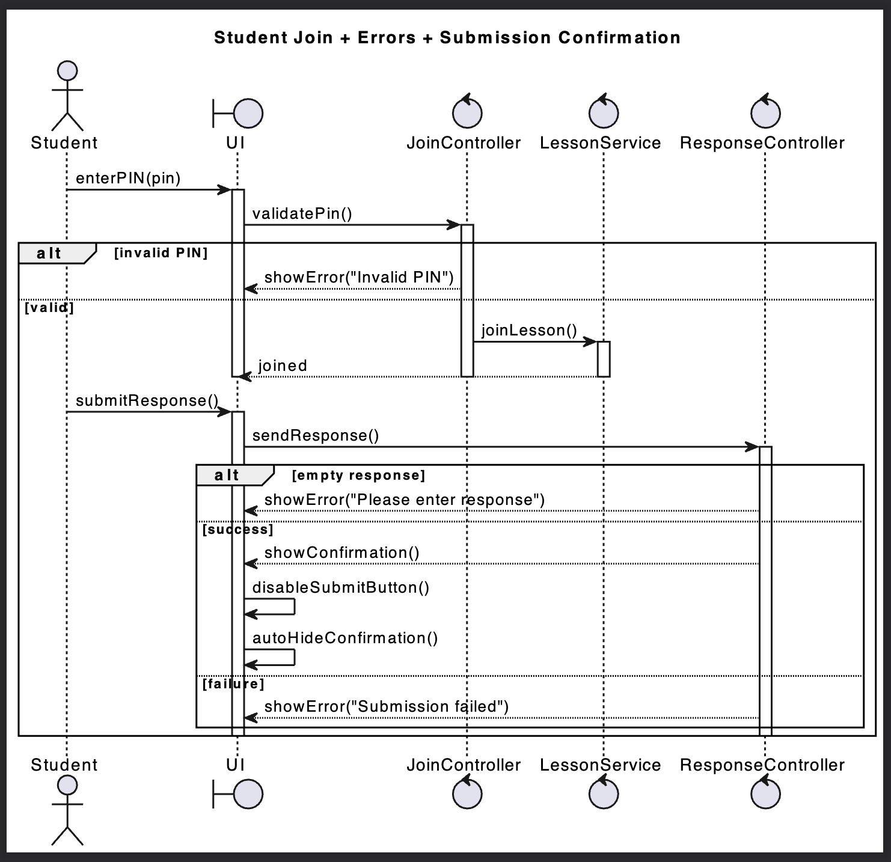

### Student MCQ Feedback + Rejoin + Lesson End
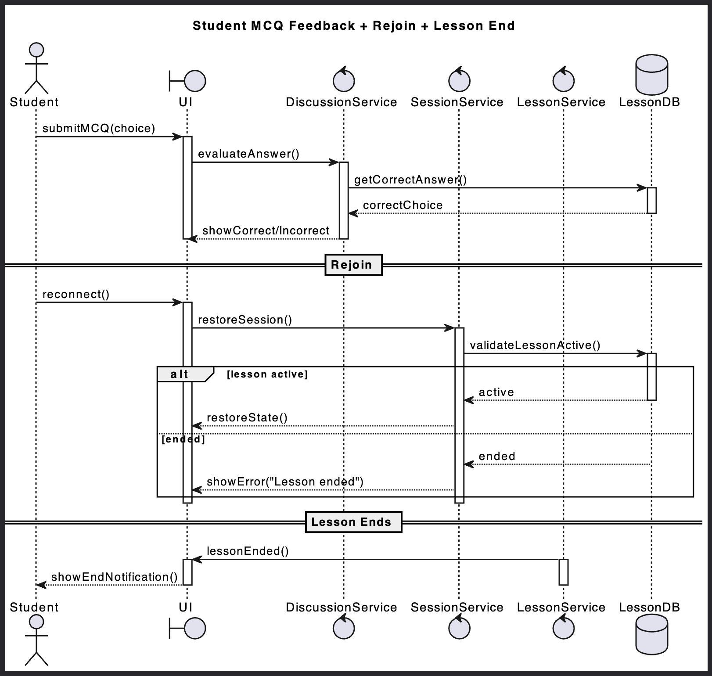

---

## Low-Fidelity User Interface

The low-fidelity user interface designs were created in Figma to explore and validate the core user flows for both instructors and students before implementation.  
These wireframes focus on layout, navigation, and system states rather than final visual styling.

🔗 **Figma Project (Source of Truth):**  
https://www.figma.com/design/M9Mnx9FE4gNmGEowfhd6gc/401_PMCOL?node-id=0-1&t=u6qQ3GQjGSBYiAz9-1

---

### Instructor Flow (Figures 1–5)

#### **Figure 1**

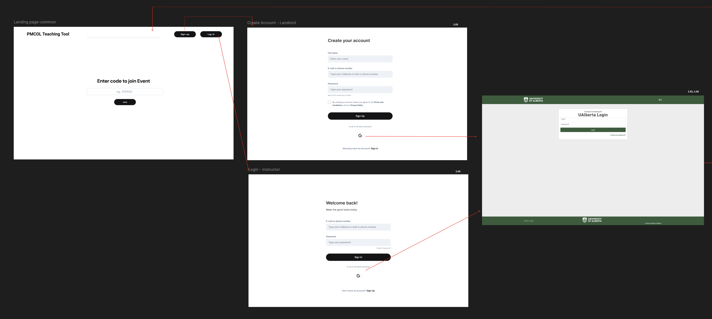

---

#### **Figure 2**

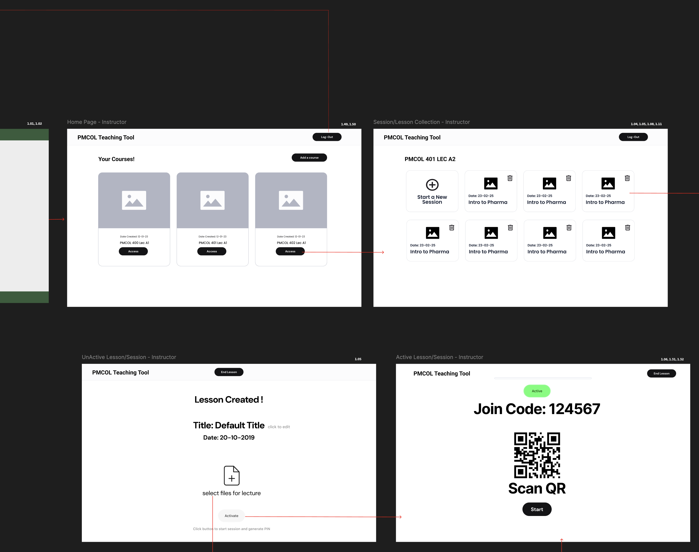

---

#### **Figure 3**

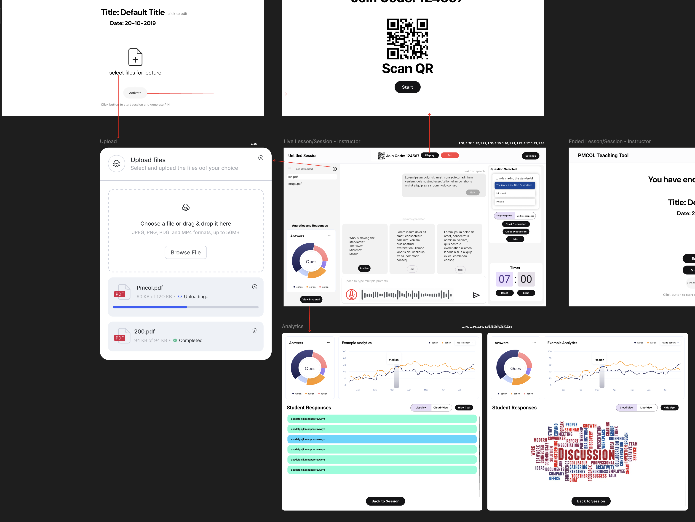

---

#### **Figure 4**

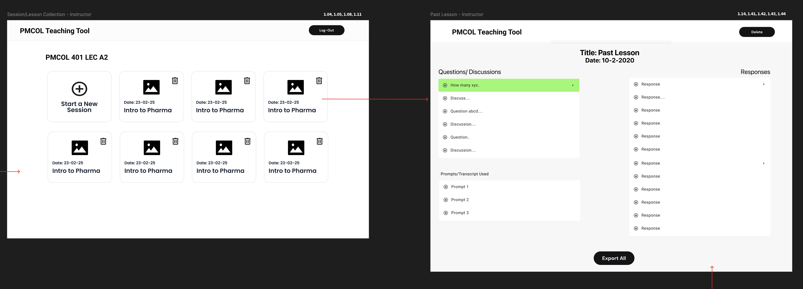

---

#### **Figure 5**

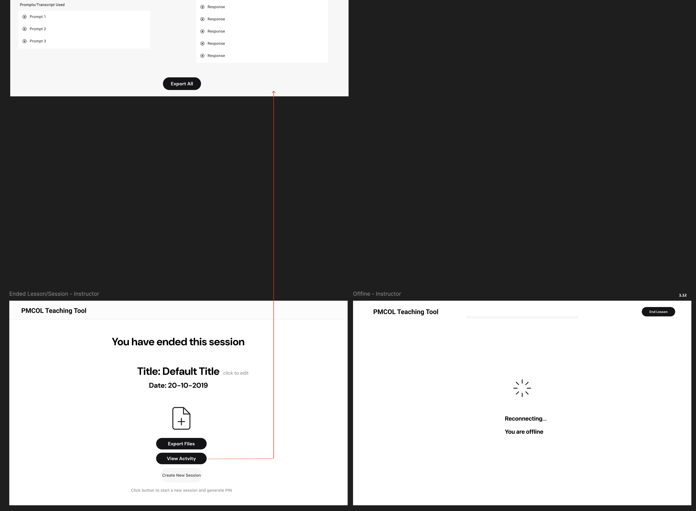

---

### Student Flow (Figure 6)

#### **Figure 6**

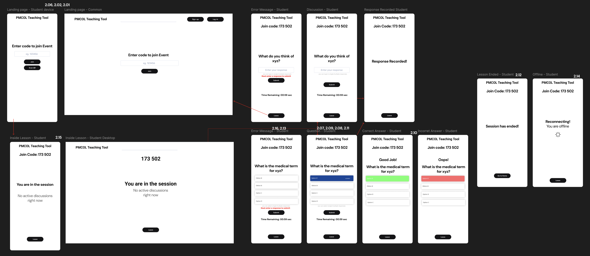

---

These low-fidelity wireframes directly informed the system architecture, user stories, and UML sequence diagrams by validating expected user behavior and system states prior to implementation.
