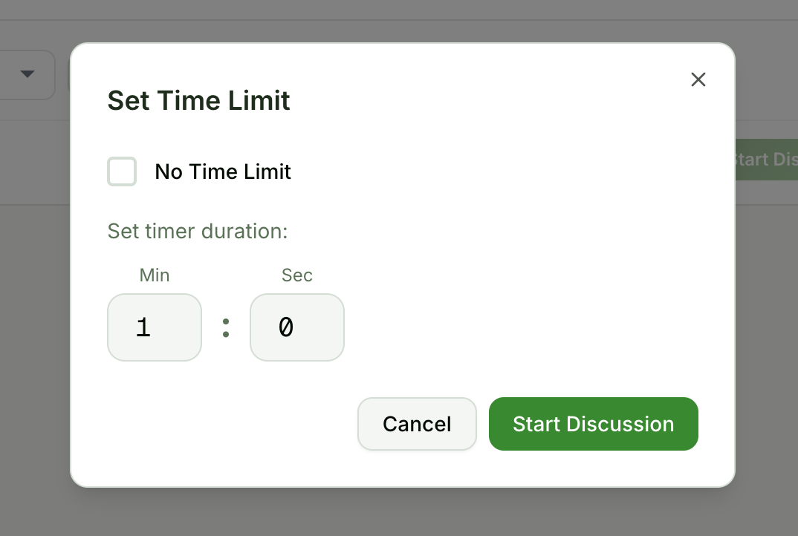
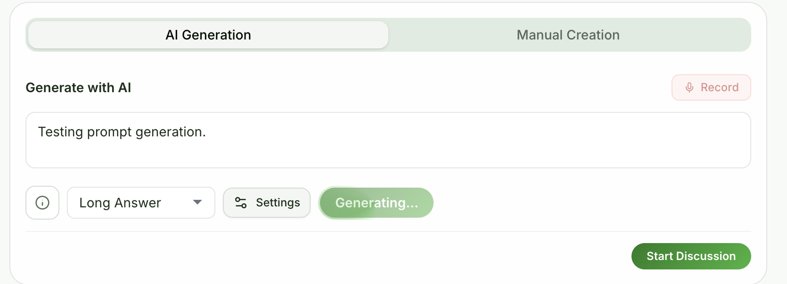
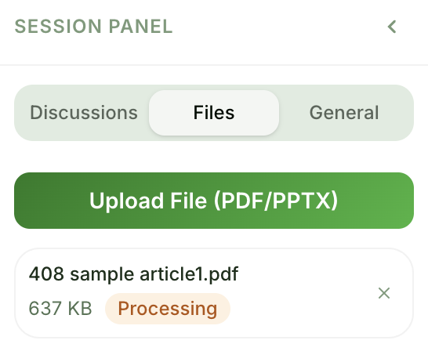
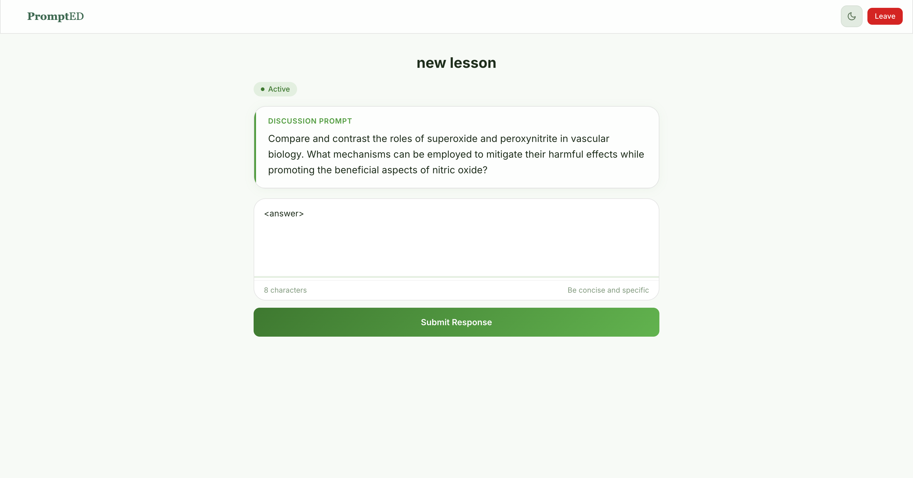
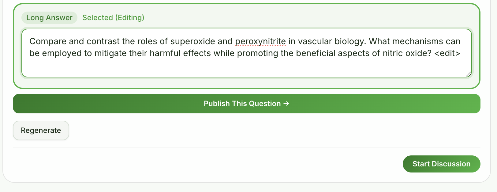

# UX Principles

Our interface is built on four core usability heuristics (adapted from Nielsen's 10 Heuristics). Every screen, button, and user flow must adhere to these rules to ensure the tool remains frictionless for students and stress-free for instructors.

### 1. Prevent Errors Before They Happen
*(Nielsen #5: Error Prevention)*

Instructors are operating in a high-stress live environment, and AI can sometimes hallucinate. The UI must protect the instructor from accidentally broadcasting incorrect information.

* **DO:** Require explicit confirmation (a two-step action or clear review screen) before an AI-generated prompt is sent to the students.
* **DON'T:** Make destructive actions (like permanently deleting a lesson or ending a live session) a single click. Always use a safety net.

<!-- SCREENSHOT: Capture the timer/confirmation dialog that appears after clicking publish.
     Shows the two-step confirmation before broadcasting a question.
     Save screenshot to: docs/images/ux-principles/error-prevention-publish-confirm.png -->

---

### 2. Keep the User Informed
*(Nielsen #1: Visibility of System Status)*

Instructors need quick confirmation the application is in the intended state. Both instructors and students need immediate feedback regarding their actions.

* **DO:** Clearly display "live" and "inactive" markers for discussions and lessons.
* **DO:** Show instant, visual success states the moment a student submits an answer so they don't submit twice.
* **DON'T:** Leave users guessing if the AI is "thinking." Always show a clear loading state when analyzing lecture audio or generating prompts.

<!-- SCREENSHOT: Capture the Files tab showing status badges (Processing/Ready) and/or
     the AI generation panel showing the "Generating..." loading state.
     Save screenshot to: docs/images/ux-principles/system-status-feedback.png -->

---

### 3. Minimalism
*(Nielsen #8: Aesthetic and Minimalist Design)*

A student's primary focus should be the lecture, not our app. Every extra button competes for their attention.

* **DO:** Keep the student login flow to a single action: scanning a QR code or entering a PIN.
* **DO:** Hide secondary instructor settings (like exporting analytics) behind menus during a live session, keeping the main dashboard focused purely on the active discussion.
* **DON'T:** Clutter the mobile view with navigation menus. Show them only the current question and the input field.

<!-- SCREENSHOT: Capture the student mobile view (~375px) showing only the active prompt
     and response input — no nav menus, no clutter.
     Save screenshot to: docs/images/ux-principles/minimalism-student-mobile.png -->

---

### 4. Provide Emergency Exits
*(Nielsen #3: User Control and Freedom)*

Lectures are dynamic. An instructor might ask the AI for a prompt, but then the class discussion naturally pivots.

* **DO:** Allow instructors to instantly cancel, edit, or regenerate an AI prompt at any point in the workflow.
* **DON'T:** Lock the instructor into a rigid, linear step-by-step process. They need the freedom to skip questions or jump back to previous ones seamlessly.

<!-- SCREENSHOT: Capture the AI generation panel showing a selected candidate being edited
     in the textarea, with the Regenerate button visible below.
     Save screenshot to: docs/images/ux-principles/emergency-exit-edit-regenerate.png -->

