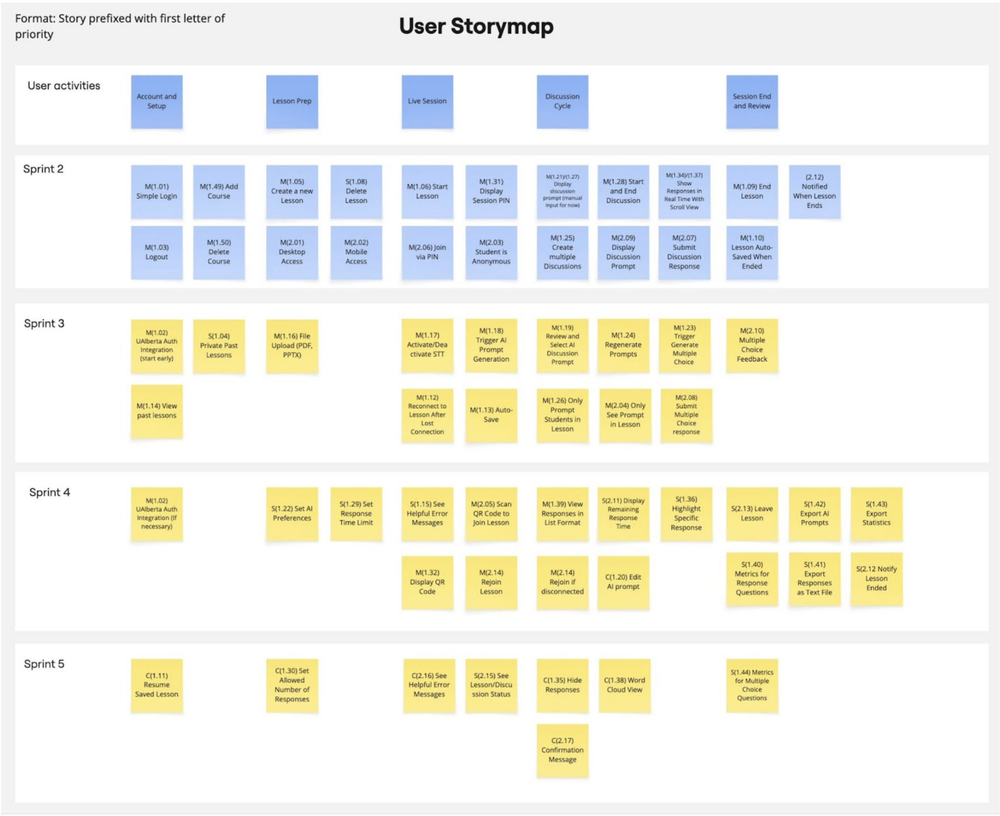

# Project Management

This document outlines the project plan and task allocation for all five sprints.  
The plan is based on the agreed story map, course milestones, and CMPUT 401 sprint expectations.

---

## Story Map

The story map represents the full scope of the project across all five sprints, categorized using the MoSCoW prioritization method and aligned with the project milestones.

---

## Project Plan

---

## Sprint 1

**Due:** February 1, 2026  

Sprint 1 focuses on planning, requirements, system design, and project setup.  
Most tasks in this sprint are documentation and infrastructure related.

### Tasks

| **Section** | **Task** | **Assigned To** |
|------------|----------|-----------------|
| Project Requirements | Executive summary | Team |
| Project Requirements | Project glossary | Team |
| Project Requirements | User stories drafting | Kris, Sid, Nikita |
| Project Requirements | Acceptance criteria | Kris |
| Project Requirements | Product research & similar tools | Team |
| Project Requirements | Technical resources | Team |
| Software Design | Architecture diagram | Kris |
| Software Design | UML class diagram | Aldo, Shahbaz |
| Software Design | Sequence diagrams | Nikita, Muaadh |
| Software Design | Low-fidelity UI wireframes | Tommy, Siddhant |
| Project Management | Story map creation | Aldo |
| Project Management | Sprint planning | Team |
| Teamwork | Team canvas | Team |
| Teamwork | Belbin roles | Team |
| Documentation | MkDocs setup & configuration | Siddhant |
| Documentation | GitHub Pages deployment | Siddhant |
| Meetings | Meeting minutes | Tommy |

**Sprint 1 Notes**
- UI wireframes completed on **January 28**
- User stories fully completed on **January 28**
- UML and sequence diagrams finalized by **January 30–31**

---

## Sprint 2

**Due:** February 15, 2026  

Sprint 2 delivers the **walking skeleton** of the system with core lesson and discussion functionality.

### User Stories

| **User Story** | **Description** | **Story Points** |
|----------------|-----------------|------------------|
| 1.01 | Create instructor account | 3 |
| 1.03 | Logout securely | 2 |
| 1.05 | Create new lesson | 3 |
| 1.06 | Start lesson (PIN/QR) | 3 |
| 1.09 | End lesson | 3 |
| 1.10 | Auto-save lesson | 5 |
| 1.25 | Multiple discussions per lesson | 3 |
| 1.27 | Display discussion prompt | 1 |
| 1.28 | Start/close discussions | 3 |
| 1.31 | Display PIN code | 1 |
| 1.34 | Real-time responses | 3 |
| 2.03 | Anonymous student access | 1 |
| 2.06 | Join lesson via PIN | 3 |
| 2.07 | Submit text responses | 2 |

**Estimated Sprint Velocity:** ~30–35 points

### Tasks

| **Task** | **Related US** | **Assignee** | **Due Date** |
|---------|---------------|--------------|--------------|
| Backend project setup | SETUP | Team | Feb 3 |
| Database schema setup | SETUP | Backend | Feb 4 |
| Lesson creation API | 1.05 | Backend | Feb 6 |
| Lesson start/end logic | 1.06, 1.09 | Backend | Feb 7 |
| PIN/QR generation | 1.06, 1.31 | Backend | Feb 8 |
| Student join flow | 2.06 | Frontend | Feb 9 |
| Anonymous access handling | 2.03 | Backend | Feb 9 |
| Discussion lifecycle | 1.25, 1.28 | Backend | Feb 10 |
| Real-time responses (WebSocket) | 1.34 | Backend | Feb 11 |
| Discussion UI | 1.27 | Frontend | Feb 12 |
| End-to-end testing | All | Team | Feb 14 |

---

### Sprint 3
...

### Sprint 4
...

### Sprint 5
...
