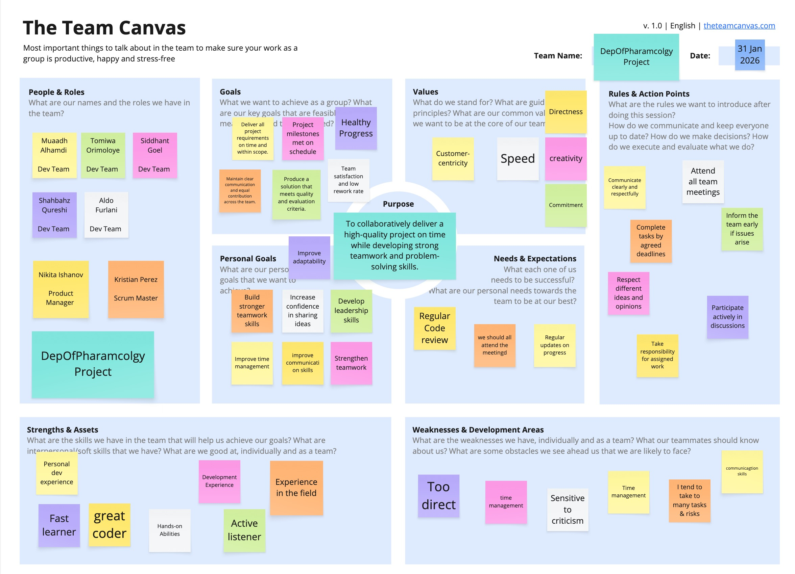

# Teamwork

## Team Canvas

---

## Scrum Roles
- **Scrum Master:** Kristian Perez
- **Product Owner:** Nikita Ishanov

---

## Belbin Roles

### Team Role Overview

| **Name**              | **Preferred Roles** | **Manageable Roles** | **Least Preferred Roles** |
|-----------------------|---------------------|----------------------|---------------------------|
| **Tomiwa Orimoloye**  | SP, ME, CF          | SH, IMP, PL          | TW, CO, RI                |
| **Nikita Ishanov**    | SH, CO, IMP         | RI, ME, CF           | TW, SP, PL                |
| **Siddhant Goel**     | CF, IMP, PL         | RI, ME, TW           | CO, SP, SH                |
| **Kristian Perez**   | IMP, CF, SP         | SH, PL, ME           | RI, TW, CO                |
| **Muaadh Alhamdi**   | CO, CF, IMP         | TW, SH, RI           | SP, PL, ME                |
| **Aldo Furlani**     | IMP, SP, ME         | CF, SH, RI           | PL, CO, TW                |
| **Shahbahz Qureshi** | ME, PL, IMP         | CF, SP, RI           | TW, CO, SH                |

---

## Belbin Role Breakdown

### 🧠 Thinking Roles

#### **PL — Plant**
*Tends to be highly creative and good at solving problems in unconventional ways.*

- **Preferred:** Siddhant Goel, Shahbahz Qureshi  
- **Manageable:** Kristian Perez, Tomiwa Orimoloye  

#### **ME — Monitor Evaluator**
*Provides a logical eye, making impartial judgements and weighing options objectively.*

- **Preferred:** Tomiwa Orimoloye, Aldo Furlani, Shahbahz Qureshi  
- **Manageable:** Siddhant Goel  

#### **SP — Specialist**
*Brings in-depth knowledge of a key area to the team.*

- **Preferred:** Tomiwa Orimoloye, Aldo Furlani, Kristian Perez  
- **Manageable:** Shahbahz Qureshi  

---

### ⚙️ Action Roles

#### **SH — Shaper**
*Drives the team forward and maintains momentum.*

- **Preferred:** Nikita Ishanov  
- **Manageable:** Tomiwa Orimoloye, Muaadh Alhamdi  

#### **IMP — Implementer**
*Plans and executes workable strategies efficiently.*

- **Preferred:** Kristian Perez, Aldo Furlani, Nikita Ishanov, Shahbahz Qureshi  

#### **CF — Completer Finisher**
*Ensures high-quality output by identifying errors and polishing work.*

- **Preferred:** Siddhant Goel, Kristian Perez, Muaadh Alhamdi  
- **Manageable:** Shahbahz Qureshi  

---

### 🤝 People Roles

#### **RI — Resource Investigator**
*Explores opportunities and brings external ideas into the team.*

- **Manageable:** Nikita Ishanov, Siddhant Goel, Aldo Furlani, Shahbahz Qureshi  

#### **TW — Teamworker**
*Supports collaboration and helps the team gel effectively.*

- **Manageable:** Siddhant Goel  

#### **CO — Co-ordinator**
*Clarifies goals, delegates tasks, and keeps the team aligned.*

- **Preferred:** Muaadh Alhamdi, Nikita Ishanov  
